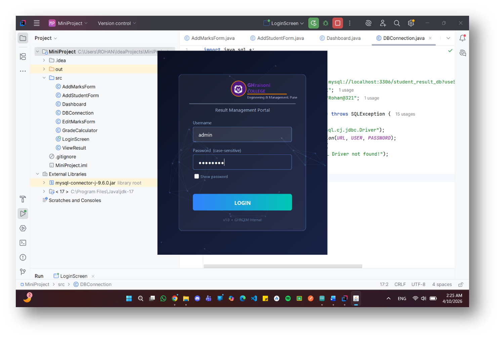
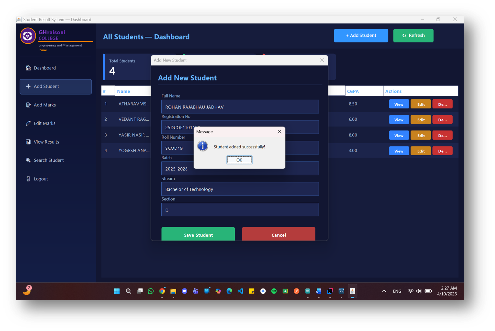
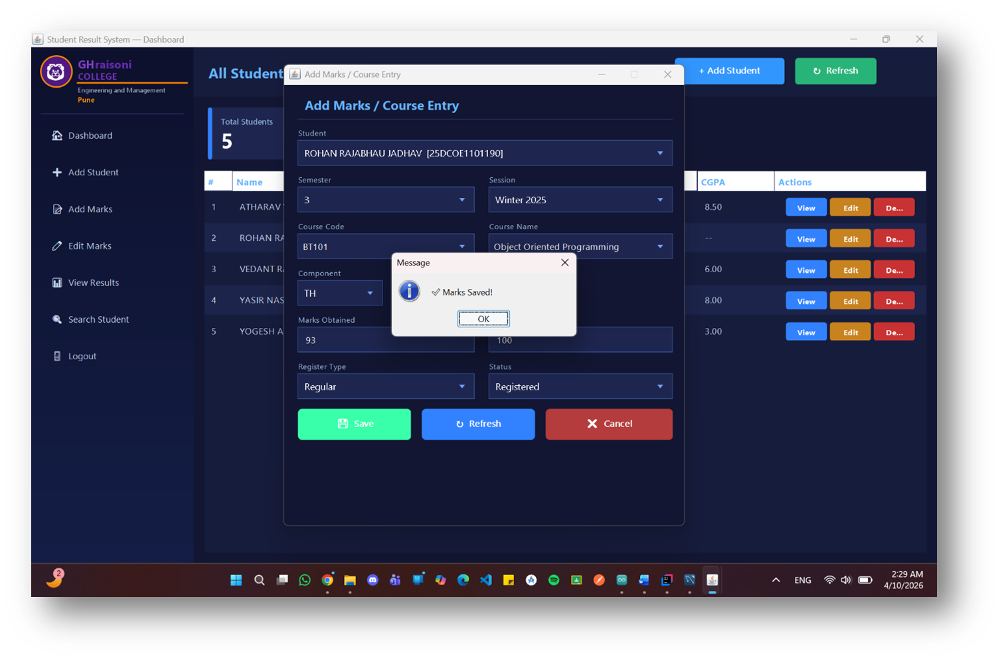
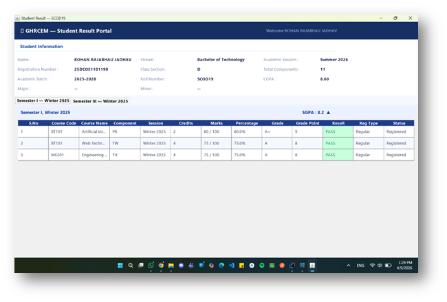
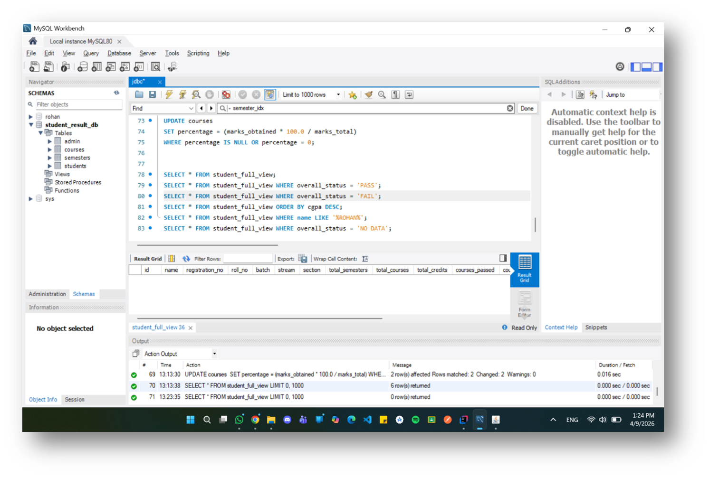

<div align="center">

```
███████╗██████╗ ███╗   ███╗███████╗
██╔════╝██╔══██╗████╗ ████║██╔════╝
███████╗██████╔╝██╔████╔██║███████╗
╚════██║██╔══██╗██║╚██╔╝██║╚════██║
███████║██║  ██║██║ ╚═╝ ██║███████║
╚══════╝╚═╝  ╚═╝╚═╝     ╚═╝╚══════╝
  Student Result Management System
```

# 📊 Student Result Management System

**`SRMS v1.0`** — *Grades. Records. Performance. Automated.*

[](https://openjdk.org/)
[](https://mysql.com)
[](https://docs.oracle.com/javase/tutorial/jdbc/)
[](https://docs.oracle.com/javase/tutorial/uiswing/)
[](https://www.jetbrains.com/idea/)
[](LICENSE)
[](https://github.com/rohan-jadhav-dev/Student-Result-Management-System)

<br/>

> *"Academic results shouldn't live in spreadsheets and paper files.*
> *SRMS digitizes them — structured, fast, and grade-accurate."*

<br/>

---

</div>

## 📌 What is SRMS?

**SRMS** is a desktop-grade academic management application that replaces manual result tracking with an intelligent, database-backed system. Built with **Java Swing** for the interface and **MySQL via JDBC** for data persistence, it automates the entire academic result pipeline — from student registration to CGPA computation — in one clean, admin-controlled portal.

---

## 🏗️ System Architecture

```
┌──────────────────────────────────────────────────────────────┐
│                  PRESENTATION LAYER                          │
│                 Java Swing (GUI Panels)                      │
│                                                              │
│  LoginScreen → Dashboard → AddStudent → AddMarks            │
│               ↓              ↓              ↓                │
│           EditMarks      ViewResult    SearchStudent         │
└────────────────────────┬─────────────────────────────────────┘
                         │  Event Listeners / ActionHandlers
                         ▼
┌──────────────────────────────────────────────────────────────┐
│                  BUSINESS LOGIC LAYER                        │
│                                                              │
│  GradeCalculator  ←  Percentage / Grade / Grade Points       │
│                       SGPA per Semester / CGPA overall       │
└────────────────────────┬─────────────────────────────────────┘
                         │  JDBC via DBConnection
                         ▼
┌──────────────────────────────────────────────────────────────┐
│              DATABASE LAYER  —  student_result_db            │
│                                                              │
│   ┌──────────┐    ┌────────────┐    ┌──────────────┐        │
│   │ students │───▶│ semesters  │───▶│   courses    │        │
│   └──────────┘    └────────────┘    └──────────────┘        │
│   ┌──────────┐                                               │
│   │  admin   │  ← Authentication                            │
│   └──────────┘                                               │
└──────────────────────────────────────────────────────────────┘
```

---

## ⚙️ Tech Stack

| Layer | Technology | Role |
|---|---|---|
| **GUI** | Java Swing + AWT | Desktop interface, panels, dialogs, tables |
| **Logic** | Java 17+ | Grade computation, session management |
| **DB Driver** | MySQL Connector/J 9.6.0 | JDBC bridge between Java and MySQL |
| **Database** | MySQL 8.x | Persistent relational academic data storage |
| **IDE** | IntelliJ IDEA | Development & debugging environment |

---

## 🗂️ Project Structure

```
MiniProject/
│
├── src/
│   ├── 🔌 DBConnection.java          ← JDBC singleton — manages DB connection
│   ├── 🔐 LoginScreen.java           ← Admin authentication portal
│   ├── 🖥️  Dashboard.java            ← Main hub: student list, pass/fail stats
│   ├── ➕ AddStudentForm.java         ← Register new student with full profile
│   ├── 📝 AddMarksForm.java          ← Subject-wise marks & course entry
│   ├── ✏️  EditMarksForm.java         ← Update existing course records
│   ├── 📊 ViewResult.java            ← Detailed result view with SGPA/CGPA
│   └── 🧮 GradeCalculator.java       ← Auto-computation engine
│
├── mysql-connector-j-9.6.0.jar       ← JDBC driver dependency
└── MiniProject.iml                   ← IntelliJ module config
```
---

## 📸 Screenshots

> A visual walkthrough of SRMS in action.

### 🔐 Login Portal


### 🖥️ Dashboard — Student Overview


### 📝 Marks Entry


### 📊 View Result — SGPA / CGPA Breakdown


### 🗄️ MySQL Workbench — Live Database


---

---

## 🧩 Features Deep Dive

### 🔐 Secure Login
- Admin-only access portal
- Case-sensitive password validation
- GH Raisoni branded login screen

### 🖥️ All Students — Dashboard
- Live counters: **Total Students · Pass · Fail**
- Tabular view: Name, Reg No, Roll No, Batch, Stream, Section, CGPA
- Per-student quick actions: **View · Edit · Delete**
- `+ Add Student` and `↻ Refresh` buttons

### ➕ Add Student
- Full profile entry: Name, Registration No, Roll No, Batch, Stream, Section
- Instant DB write with success confirmation dialog
- Auto-updates dashboard on save

### 📝 Add Marks / Course Entry
- Student selector dropdown (live from DB)
- Semester number + session picker
- Course Code, Course Name, Component (TH/PR/TW/OR)
- Marks Obtained vs Total, Register Type, Status
- Auto-triggers GradeCalculator on save

### ✏️ Edit Marks
- Search course by Semester + Code
- Live form population from DB
- Save Changes → immediate DB update

### 📊 View Result
- Full semester-wise breakdown table
- Columns: S.No · Course Code · Course Name · Component · Session · Credits · Marks · **Percentage** · **Grade** · **Grade Points** · **Result** · Reg Type · Status
- Header: Name · Stream · Reg No · Batch · Section · SGPA · CGPA

### 🔍 Search Student
- Search by Registration No or Roll No
- Input dialog → instant filtered result

### 🧮 Auto Grade Computation
| Marks | Grade | Grade Point |
|---|---|---|
| 90–100 | A+ | 10 |
| 80–89 | A | 9 |
| 70–79 | B+ | 8 |
| 60–69 | B | 7 |
| 50–59 | C | 6 |
| 40–49 | D | 5 |
| < 40 | F | 0 |

> SGPA = Σ(Credits × Grade Points) / Σ(Credits) per semester  
> CGPA = Average of all semester SGPAs

---

## 🛢️ Database Schema

```sql
CREATE DATABASE IF NOT EXISTS student_result_db;
USE student_result_db;

-- Admin
CREATE TABLE admin (
  id       INT AUTO_INCREMENT PRIMARY KEY,
  username VARCHAR(50)  NOT NULL,
  password VARCHAR(100) NOT NULL
);

-- Students
CREATE TABLE students (
  id               INT AUTO_INCREMENT PRIMARY KEY,
  name             VARCHAR(100) NOT NULL,
  registration_no  VARCHAR(30)  UNIQUE NOT NULL,
  roll_no          VARCHAR(20),
  batch            VARCHAR(20),
  stream           VARCHAR(100),
  section          VARCHAR(10),
  cgpa             DECIMAL(4,2) DEFAULT 0.00
);

-- Semesters
CREATE TABLE semesters (
  id          INT AUTO_INCREMENT PRIMARY KEY,
  student_id  INT NOT NULL,
  sem_number  INT NOT NULL,
  session     VARCHAR(30),
  sgpa        DECIMAL(4,2) DEFAULT 0.00,
  FOREIGN KEY (student_id) REFERENCES students(id) ON DELETE CASCADE
);

-- Courses
CREATE TABLE courses (
  id              INT AUTO_INCREMENT PRIMARY KEY,
  semester_id     INT NOT NULL,
  course_code     VARCHAR(20),
  course_name     VARCHAR(100),
  component       ENUM('TH','PR','TW','OR'),
  credits         INT DEFAULT 0,
  marks_obtained  DECIMAL(5,2),
  marks_total     DECIMAL(5,2),
  percentage      DECIMAL(5,2),
  grade           VARCHAR(5),
  grade_point     DECIMAL(3,1),
  register_type   ENUM('Regular','Ex-Student','ATKT'),
  status          ENUM('Registered','Cancelled'),
  result          ENUM('PASS','FAIL'),
  FOREIGN KEY (semester_id) REFERENCES semesters(id) ON DELETE CASCADE
);

-- View
DROP VIEW IF EXISTS student_full_view;
CREATE VIEW student_full_view AS
SELECT
    st.id, st.name, st.registration_no, st.roll_no,
    st.batch, st.stream, st.section,
    COUNT(DISTINCT s.id)  AS total_semesters,
    COUNT(DISTINCT c.id)  AS total_courses,
    COALESCE(SUM(CASE WHEN c.credits > 0 THEN c.credits ELSE 0 END), 0) AS total_credits,
    COALESCE(SUM(CASE WHEN c.result = 'PASS' THEN 1 ELSE 0 END), 0) AS courses_passed,
    COALESCE(SUM(CASE WHEN c.result = 'FAIL' THEN 1 ELSE 0 END), 0) AS courses_failed,
    CASE
        WHEN COUNT(c.id) = 0 THEN 'NO DATA'
        WHEN SUM(CASE WHEN c.result = 'FAIL' THEN 1 ELSE 0 END) > 0 THEN 'FAIL'
        ELSE 'PASS'
    END AS overall_status,
    ROUND(IFNULL(st.cgpa, 0), 2) AS cgpa,
    (SELECT s2.session FROM semesters s2
     WHERE s2.student_id = st.id
     ORDER BY s2.sem_number DESC LIMIT 1) AS latest_session,
    (SELECT c2.register_type FROM courses c2
     JOIN semesters s2 ON c2.semester_id = s2.id
     WHERE s2.student_id = st.id
     GROUP BY c2.register_type
     ORDER BY COUNT(*) DESC LIMIT 1) AS register_type
FROM students st
LEFT JOIN semesters s ON s.student_id = st.id
LEFT JOIN courses c   ON c.semester_id = s.id
GROUP BY st.id, st.name, st.registration_no, st.roll_no,
         st.batch, st.stream, st.section, st.cgpa
ORDER BY st.name;

-- Default admin
INSERT INTO admin (username, password) VALUES ('admin', 'admin123');

---

## 🚀 Getting Started

### Prerequisites

```
✅ Java JDK 17 or above
✅ MySQL Server 8.x
✅ IntelliJ IDEA (recommended)
✅ mysql-connector-j-9.6.0.jar (included in project)
```

### Step-by-Step Setup

**1. Clone the repo**
```bash
git clone https://github.com/rohan-jadhav-dev/Student-Result-Management-System.git
cd Student-Result-Management-System
```

**2. Create the database**
```sql
CREATE DATABASE student_result_db;
USE student_result_db;
-- Run the schema SQL above
-- Or import provided dump file
```

**3. Configure DBConnection.java**
```java
private static final String URL      = "jdbc:mysql://localhost:3306/student_result_db?useSSL=false";
private static final String USER     = "root";
private static final String PASSWORD = "your_password";
```

**4. Add JDBC Driver in IntelliJ**
```
File → Project Structure → Modules → Dependencies
→ Click [+] → JARs or Directories
→ Select: mysql-connector-j-9.6.0.jar
→ Apply & OK
```

**5. Run the app**
```bash
# IntelliJ: Right-click LoginScreen.java → Run

# Terminal (Windows):
javac -cp .;mysql-connector-j-9.6.0.jar src/*.java
java  -cp .;mysql-connector-j-9.6.0.jar LoginScreen

# Terminal (Mac/Linux):
javac -cp .:mysql-connector-j-9.6.0.jar src/*.java
java  -cp .:mysql-connector-j-9.6.0.jar LoginScreen
```

**6. Default login credentials**
```
Username: admin
Password: (set in your admin table)
```

---

## 🔬 Request Flow — How It Works

```
Admin clicks "Save" (e.g., Add Marks)
           │
           ▼
 ActionListener fires in AddMarksForm
           │
           ▼
  Reads form input → validates fields
           │
           ▼
   DBConnection.getConnection()
           │
           ▼
  PreparedStatement → INSERT INTO courses(...)
           │
           ▼
  GradeCalculator.compute(marks, total)
       → percentage, grade, gradePoint
           │
           ▼
  UPDATE semesters SET sgpa = ...
  UPDATE students  SET cgpa = ...
           │
           ▼
  Success dialog shown + Dashboard refreshes
```

---

## 📸 Application Preview

| Screen | Description |
|---|---|
| 🔐 **Login Portal** | GHRaisoni branded secure admin login |
| 🖥️ **Dashboard** | All students table with pass/fail counters |
| ➕ **Add Student** | Complete profile registration form |
| 📝 **Add Marks** | Course + semester marks entry with confirmation |
| ✏️ **Edit Marks** | Course detail modification dialog |
| 📊 **View Result** | Full SGPA/CGPA academic result breakdown |
| 🔍 **Search** | Roll no / Reg no quick lookup |
| 🗄️ **MySQL Workbench** | Live verified data in `student_result_db` |

---

## 📐 Engineering Decisions

- **Singleton DB Connection** — `DBConnection.getConnection()` returns a single managed JDBC connection, avoiding redundant socket overhead
- **PreparedStatement** — All queries use parameterized statements, preventing SQL injection
- **GradeCalculator as isolated class** — Computation logic is decoupled from UI, making it independently testable
- **MySQL Views** — `student_full_view` aggregates cross-table joins for efficient dashboard queries
- **ENUM columns** — `component`, `register_type`, `status`, `result` use MySQL ENUMs for type safety at DB level

---

## 🛣️ Roadmap

- [ ] 🔒 Role-based access: Admin vs Faculty vs Student portals
- [ ] 📄 PDF result card export (iText library)
- [ ] 📊 Visual analytics — bar/pie charts per batch (JFreeChart)
- [ ] 🔔 Email notification on result publish
- [ ] 🌐 Web version — Spring Boot REST API + React frontend
- [ ] 📱 Student mobile app — view own results

---

## 👨‍💻 Author

<div align="center">

**Rohan Rajabhau Jadhav**
`SCOD19 · Computer Engineering · Batch 2025–2028`
`Java Programming — 23UCOPCP2406`

*Under the guidance of* **Prof. Amol Rindhe**

*G.H. Raisoni College of Engineering and Management, Pune – 412207*

[](https://github.com/rohan-jadhav-dev)

</div>

---

## 📄 License

```
MIT License — open to use, fork, and build upon.
Attribution appreciated.
```

---

<div align="center">

**⭐ Drop a star if this project helped or inspired you.**

*Crafted with ☕ Java, 📐 precision, and the drive to make academic chaos disappear.*

```
"Stop managing results manually.
 Let the system do what systems do best."
                          — SRMS v1.0
```

</div>
